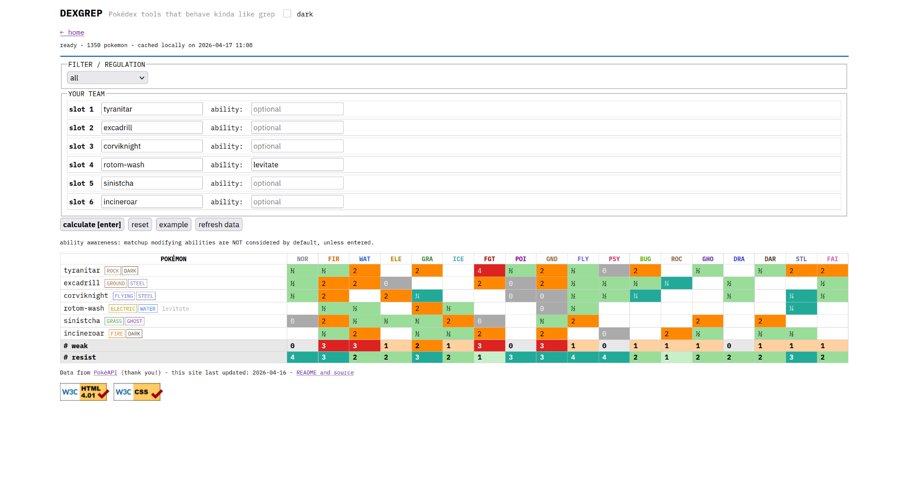

# DEXGREP

Free and open source Pokédex tools that behave kinda like `grep` (the globally searching and printing them part).

Static site. No build, no dependencies.
Visit at: https://dexgrep.com/ or clone and run locally (see below).

## Tools - More information and examples below

- **Pokémon Search**: filter all Pokémon that match specified criteria, highly configurable
- **Team Type Matchups**: enter a team and see each member's weaknesses and resistances, with aggregate counts

## Running Locally

The site uses `fetch()` for filter data, so it needs served over HTTP. Opening `index.html` directly as a file won't work.

```bash
git clone https://github.com/btenc/dexgrep
cd dexgrep
python3 -m http.server
# open http://localhost:8000
```

## Pokemon Search

Create simple or complex queries that return all Pokémon that match the constraints.

### Usage

1. Add filters using the `+` buttons in each section
2. Press **run** or hit Enter to query
3. Results show type matchup columns computed with ability awareness
4. Click any stat column header to sort
5. Use **share** to copy a URL that restores the current query

### Filters

- **Name**: include or exclude by name substring, AND/OR-able
- **Type**: filter by the Pokémon's own type(s), AND/OR-able
- **Moves**: filter by possible moves, with optional STAB check, AND/OR-able
- **Type Effectiveness**: filter by how a type hits the Pokémon (resists, immune, weak, etc.)
- **Ability**: filter by ability name, OR-able
- **Stats**: numeric comparisons on any stat, BST, or dex #, AND-able
- **Filters**: limit results to one or more competitive formats or curated Pokédex lists, AND-able across categories

### Examples

"What are all the electric type Pokémon that are dual type with either ghost or flying, can use Discharge or Thunderbolt, Volt Switch, and either Shadow Ball with STAB or Tailwind, are immune to ground, and have a special attack equal to or over 90 sorted by special attack descending?"

<details>
<summary>Example screenshot</summary>


</details>

"What is the fastest alolan Pokémon?"

<details>
<summary>Example screenshot</summary>


</details>

### Abilities not taken into account for type matchups

- **Filter / Solid Rock / Prism Armor**: reduce super-effective damage by 25%, still "weak" to those types (1.5x)
- **Multiscale / Shadow Shield / Tera Shell**: conditional (full HP, first hit), not static
- **Ice Scales / Punk Rock**: halve a damage category (special / sound), not type-specific
- **Protean / Libero / Forecast / Multitype / RKS System**: type changes dynamically
- **Fluffy** (contact halving part, fire weakness is used), **Soundproof**, **Bulletproof**: move-specific, not type-specific

## Team Type Matchups

Show an analysis / breakdown of the entered team's weaknesses and resistances.

### Usage

1. Optionally select a filter to constrain the Pokémon to a specific format or list
2. Type a Pokémon name into any of the 6 team slots (autocomplete supported)
3. Optionally enter an ability override in the second field for each slot to account for matchup-modifying abilities (e.g. Levitate, Flash Fire)
4. Press **calculate** or hit Enter
5. Use **share** to copy a URL that restores the current result table.

The grid shows each Pokémon's defensive matchup against all 18 types. Aggregate weak/resist counts appear at the bottom.

<details>
<summary>Example screenshot</summary>



</details>

## Data

Fetched from [PokéAPI](https://pokeapi.co) and cached to your browser's localStorage. Hit "refresh data" to re-fetch from the API (this is limited to once per day).

## Development

All files formatted with [Prettier](https://prettier.io) using the default config.
Before pushing:

```bash
npx prettier@latest . --write
```

### Guidelines

- Any logic that could reasonably apply to more than one tool should live in `shared.js`: please pull the generic part out rather than duplicating it.
- Readability is preferred over clever or overly compact code.

### On AI Use

Contributions that are AI-assisted are welcome, but all code should be reviewed and understood by the contributor before submitting. This is a "for fun" project, if you are not learning something, what's the point?

### Adding Filters

Drop a JSON file (array of PokéAPI slugs) into `filters/` and add an entry to `filters/index.json`:

```json
{ "id": "your-filter", "name": "Display Name", "category": "Category Name" }
```

The optional `gen` field auto-applies a generation when the filter is selected. The `category` field groups filters into collapsible sections in the UI.

## TODO / Issues

- Add more filters (Smogon tiers, generation dex lists, etc.)
- More cool stuff!
