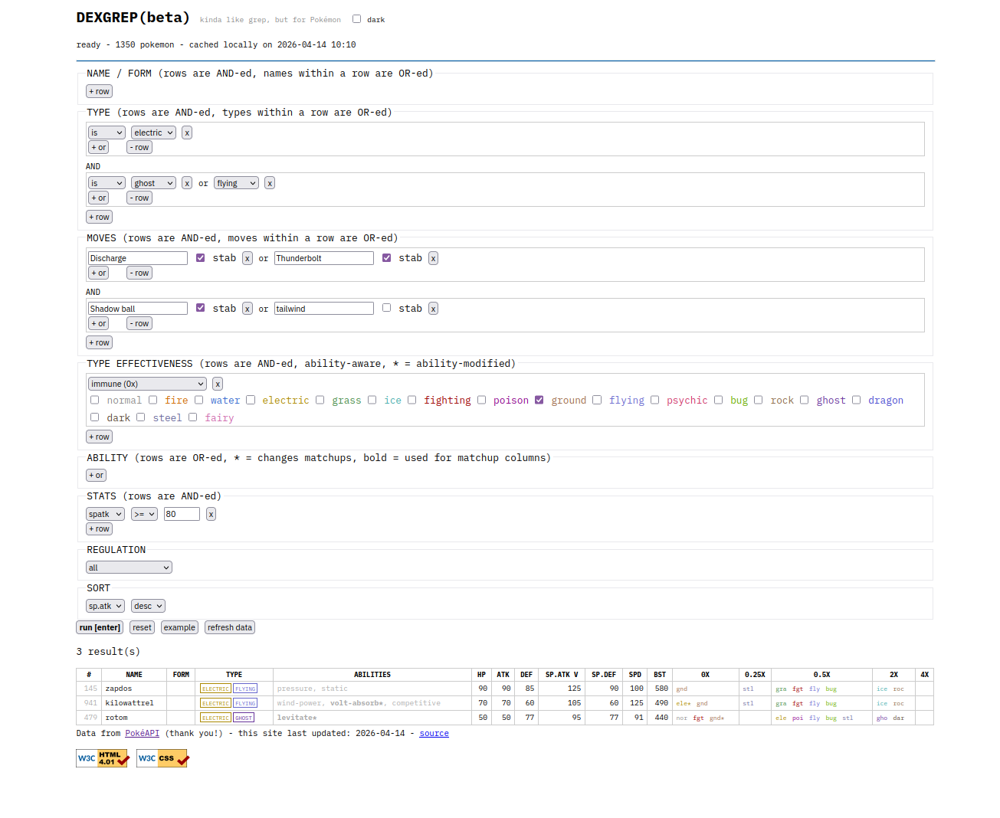
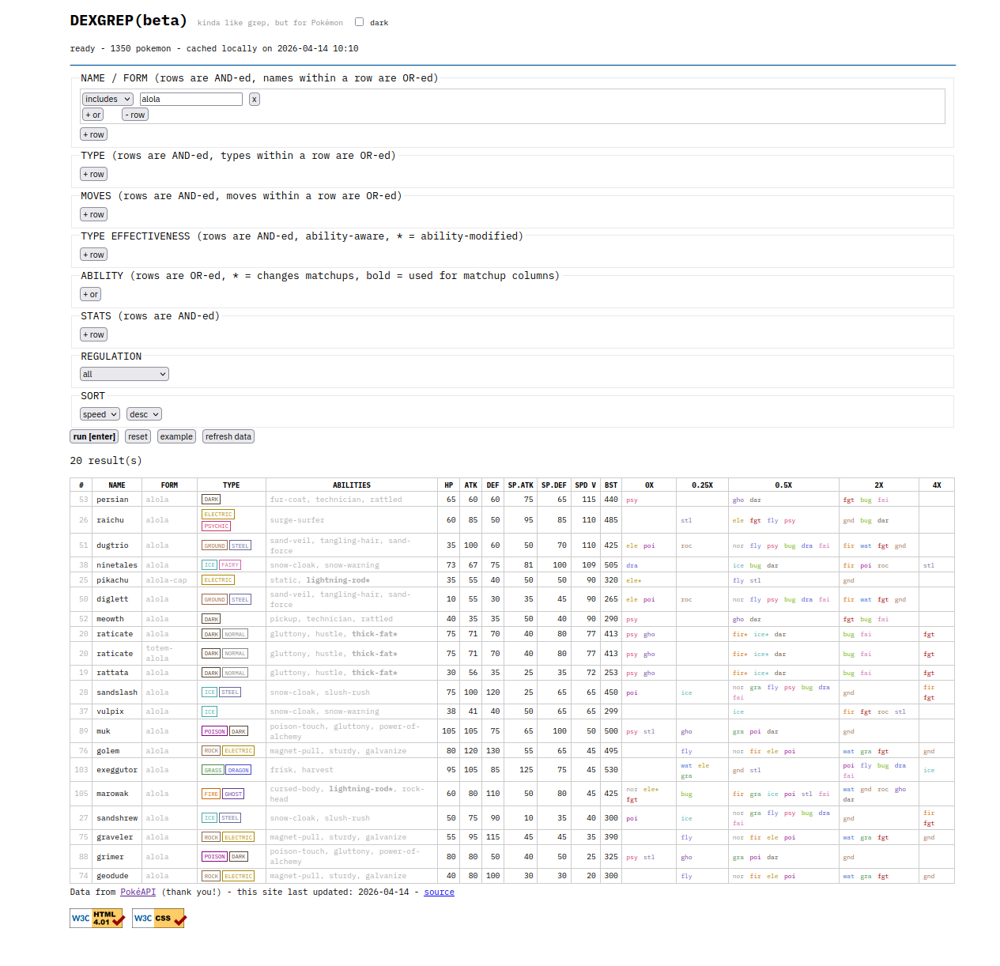

# DEXGREP

Pokédex tools that behave kinda like `grep` (the globally searching and printing them part).

Static site. No build, no dependencies.
Visit at: https://dexgrep.com/ or clone and run locally (see below).

## Tools - More information and examples below

- **Pokémon Search**: filter all Pokémon that match specified criteria, highly configurable
- **Team Type Matchups**: enter a team and see each member's weaknesses and resistances, with aggregate counts

## Running Locally

The site uses `fetch()` for filter data, so it needs served over HTTP. Opening `index.html` directly as a file won't work.

```bash
git clone https://github.com/btenc/dexgrep
cd dexgrep
python3 -m http.server
# open http://localhost:8000
```

## Pokemon Search

Create simple or complex queries that return all Pokémon that match the constraints.

### Usage

1. Add filters using the `+` buttons in each section
2. Press **run** or hit Enter to query
3. Results show type matchup columns computed with ability awareness
4. Click any stat column header to sort

### Filters

- **Name**: include or exclude by name substring, AND/OR-able
- **Type**: filter by the Pokémon's own type(s), AND/OR-able
- **Moves**: filter by possible moves, with optional STAB check, AND/OR-able
- **Type Effectiveness**: filter by how a type hits the Pokémon (resists, immune, weak, etc.)
- **Ability**: filter by ability name, OR-able
- **Stats**: numeric comparisons on any stat, BST, or dex #, AND-able
- **Filter / Regulation**: limit results to a specific competitive format or other filters.

### Examples

"What are all the electric type Pokémon that are dual type with either ghost or flying, can use Discharge or Thunderbolt, Volt Switch, and either Shadow Ball with STAB or Tailwind, are immune to ground, and have a special attack equal to or over 90 sorted by special attack descending?"

<details>
<summary>screenshot</summary>



</details>

"What is the fastest alolan Pokémon?"

<details>
<summary>screenshot</summary>



</details>

### Abilities not taken into account for type matchups

- **Filter / Solid Rock / Prism Armor**: reduce super-effective damage by 25%, still "weak" to those types (1.5x)
- **Multiscale / Shadow Shield / Tera Shell**: conditional (full HP, first hit), not static
- **Ice Scales / Punk Rock**: halve a damage category (special / sound), not type-specific
- **Protean / Libero / Forecast / Multitype / RKS System**: type changes dynamically
- **Fluffy** (contact halving part, fire weakness is used), **Soundproof**, **Bulletproof**: move-specific, not type-specific

## Team Type Matchups

Show an analysis of the entered team's weaknesses and resistances.

TODO

## Data

Fetched from [PokéAPI](https://pokeapi.co) and cached to your browser's localStorage. Hit "refresh data" to re-fetch from the API (pls do not spam, we are caching for a reason as they offer their API for free!).

## Development

All files formatted with [Prettier](https://prettier.io) using the default config.

### Adding Regulations

Drop a JSON file (array of PokéAPI slugs) into `filters/` and add an entry to `filters/index.json`:

```json
{ "id": "your-filter", "name": "Display Name" }
```

## TODO

- Add link sharing in URL for current tools
- Add more regulations, add Smogon regulations, add generation filters
- Add CI linting and formatting.
- More cool stuff!
